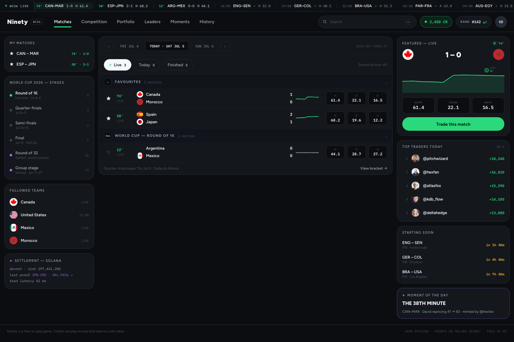
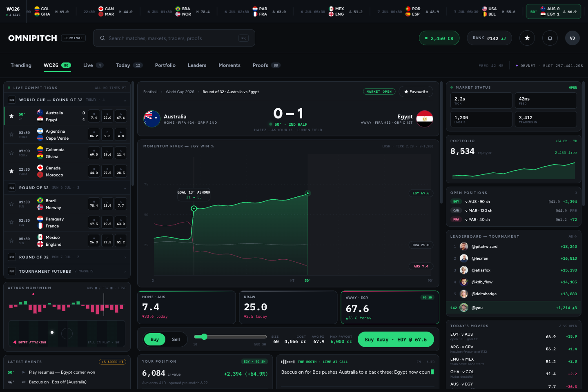
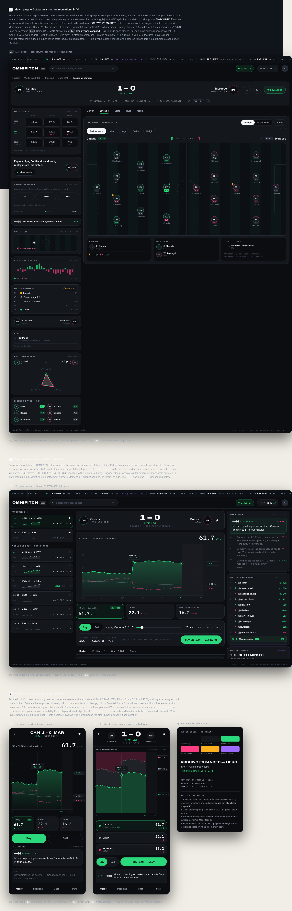
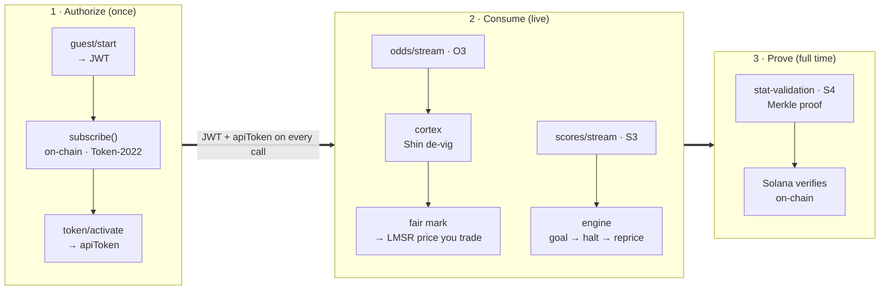
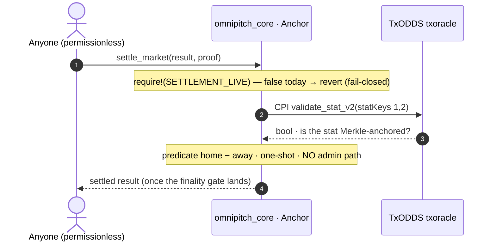
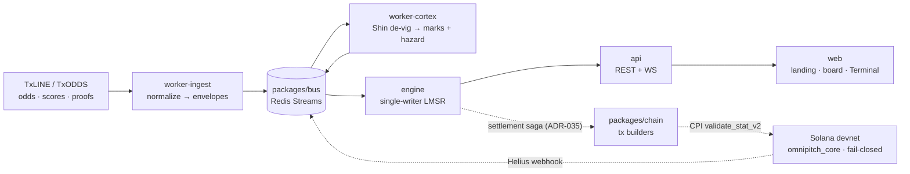

# Ninety

**Every match is a market for ninety minutes.** A free-to-play, real-time prediction exchange for World Cup 2026 — live consensus prices from TxLINE, an AI Booth narrating every swing, and results designed to settle trustlessly on Solana by verifying TxODDS's own cryptographic proofs. Strictly play-money: you trade a live probability with credits, never money.

**Live demo:** [ninety-nu.vercel.app](https://ninety-nu.vercel.app)

<p align="center">
  
  
  
  
</p>
<p align="center">
  <a href="https://github.com/Sushant6095/ninety/actions/workflows/ci.yml"></a>
  
  
  
  
  
  
  
  
  
  
</p>

## Contents

- [Read this first — the forge finding](#read-this-first--the-forge-finding)
- [By the numbers](#by-the-numbers)
- [What it is](#what-it-is) · [How it works](#how-it-works)
- [TxLINE API — the data spine](#txline-api--the-data-spine--primary-highlight)
- [Built on Solana — the trust layer](#built-on-solana--the-trust-layer--primary-highlight)
- [Architecture](#architecture) · [Repository layout](#repository-layout)
- [The settlement story](#the-settlement-story)
- [What's built and verified — and what's next](#whats-built-and-verified--and-whats-next)
- [Run it in 10 minutes](#run-it-in-10-minutes)
- [Documentation](#documentation) · [Contributing](#contributing) · [License & contact](#team-license-and-the-play-money-disclaimer)

---

## Read this first — the forge finding

We built the whole result path to settle **on-chain, with no admin able to decide a result** — the program settles only by verifying a TxODDS cryptographic proof of the score. Then two adversarial `proof-auditor` passes found something worth stopping the demo for: **TxODDS's own sanctioned settle instruction, `validate_stat_v2`, does not bind finality on-chain.**

The stat leaves carry no `Action`/finality field, and which record is `game_finalised` is chosen off-chain. So a permissionless caller could take a **100%-valid Merkle proof for statKey 1 (home goals) drawn from a mid-match batch where the home side happened to lead** and settle `result = HOME` — even though the match ended a draw or an away win. A wrong-result forge, built entirely from a genuine proof, by choosing the batch/`seq` (ADR-037). An earlier layer — feeding the `home − away` predicate two *swapped* or arbitrary anchored stats — was caught and pinned first (ADR-036).

**Our call: settlement is fail-closed on purpose.** The first line of the handler is `require!(SETTLEMENT_LIVE, …)` with `SETTLEMENT_LIVE = false` — a real revert before any state write, not a sentinel trick. Every other on-chain defense is implemented and reviewed (market↔fixture binding, oracle-program pin, stat-identity pin, one-shot, no-admin-path); the single missing piece is a trustless gate binding the proof to the finalised record. **We will not ship a settle we can prove is forgeable — even in play-money, where no funds are ever at risk.** We filed it back to the sponsor as an open question (settle via `validate_stat_v2` over scores roots + a finality gate, or via txoracle's own resolution-root path?). Full write-up: [The settlement story](#the-settlement-story) · [ADR-036](docs/adr/ADR-036-settle-market-txoracle-cpi-statkey-binding.md) · [ADR-037](docs/adr/ADR-037-settle-statkeys-1-2-game-finalised-failclosed.md).

## By the numbers

Verified against the repo, not estimated.

| | |
| :--- | :--- |
| **128** commits | in the 8-day build sprint (2026-07-07 → 2026-07-14) |
| **57** ADRs | every architectural, product, and design call recorded in [`docs/adr/`](docs/adr/) |
| **257** automated tests pass | 248 TypeScript (vitest, 6 packages) + 9 Python (pytest) |
| **5 / 5** Anchor tests | on-chain leaderboard claim, localnet |
| **TxLINE live on devnet** | subscribe → activate → snapshot ran authenticated against a real fixture |
| **axe-core: 0 violations** | across all 15 web routes |
| **Settlement fail-closed** | on purpose — see the forge finding above |

<sub>`git log --oneline | wc -l` → 128 · `ls docs/adr/ADR-*.md | wc -l` → 57 · test counts from `pnpm test` + `pytest` · a11y from `node scripts/ui/axe.mjs`.</sub>

---

<p align="center">
  
</p>

| The Terminal — pro match trading | North Star — where it's going |
| :---: | :---: |
|  |  |

---

## What it is

Ninety turns a live football match into a market. Each match opens a 1X2 market — **Home / Draw / Away** — priced 0–100 by an LMSR maker off a TxLINE consensus mark, and you buy the side you think the crowd has wrong. When a goal lands the market halts, re-anchors to the new reality, and reopens on a decaying spread; an AI Booth narrates the swing in plain language. At full time the result is meant to settle on Solana by verifying a TxODDS cryptographic proof on-chain — **no admin can decide a result**. It is play-money by construction: no deposits, no cash payouts, no real money anywhere in the system.

You arrive on a landing page whose hero is the product itself — the **Momentum River** as a live tape, and the goal→halt→reprice choreography playing on a real market as you scroll. The board (`/board`) is where you go; the Terminal is where you trade.

## How it works

**As a player.** Sign up with an email and you get **1,000 play-money credits** and a Solana wallet provisioned invisibly — no seed phrase, no extension (ADR-006, ADR-033). Open the board, tap a match that's in play, and you land on the **Terminal**: the live score, the **Momentum River** (the market's live 0–100 read of who wins), and three prices — **Home / Draw / Away**. Buy the side you think the crowd has wrong; an LMSR maker shows the cost before you confirm, a winning share is worth **100 credits**, and you can sell any time to lock in a move (ADR-002, ADR-026). At full time winners are paid, your P&L rolls up the leaderboard, and your biggest swing can mint as a Moment.

**The live loop — one match, five beats.** This is the product:

1. **Goal.** A TxLINE score-stream event (S3) arrives; the engine detects the goal.
2. **Market halts.** Trading pauses the instant the goal is confirmed (ADR-005) — no one gets filled on a stale price.
3. **Reprice.** The market re-anchors to the fresh consensus mark from the TxLINE odds stream, de-vigged by the pricing worker.
4. **Decaying spread.** It reopens on a 3× spread that decays back to normal, so the first traders in pay for the uncertainty (ADR-005).
5. **AI Booth narrates.** One two-role LLM call turns the mark move + event into commentary on `commentary.v1`, filtered so nothing that reads like gambling ever ships (ADR-038, ADR-039).

At the whistle the settlement saga (ADR-035) fetches a TxLINE proof and submits an on-chain settle; winning shares pay 100 credits. **That on-chain settle is deliberately fail-closed today — see [The settlement story](#the-settlement-story) for exactly why, and what we're asking TxODDS.**

## TxLINE API — the data spine · primary highlight

TxLINE/TxODDS is not a side input — **it feeds the prices, the scores, and the settlement proofs.** Every endpoint below is wrapped in `packages/txline/src/client.ts`, returns parsed Zod types, and was **verified live against `txline-dev` + devnet** (ADR-015/016), with one real captured payload per endpoint in [`docs/txline-samples/`](docs/txline-samples/). The live on-chain subscribe tx: [`2RMQS9tY…rZgYDPqqtX`](https://explorer.solana.com/tx/2RMQS9tYsfgnRz42pUih4meEXTB6LeDSgtjfprG51vcAdKxVZJd9G7tEsZz8WzyjC9rjmLHCjQNFw9rZgYDPqqtX?cluster=devnet).

Three phases — authorize once, consume live, prove at full time:



| Code | Endpoint | Wrapper | Powers which surface |
| :--- | :--- | :--- | :--- |
| A1–A3 | `POST /auth/guest/start` · on-chain `subscribe` · `POST /api/token/activate` | auth flow | Gates **every** data call (guest JWT + apiToken headers) |
| F1 | `GET /api/fixtures/snapshot` | `fixtures()` | Which WC26 matches exist → **the board** |
| S1 | `GET /api/scores/snapshot/{fixtureId}` | `scoresSnapshot()` | Live score on match/Terminal; settlement reads the `game_finalised` record here |
| S2 | `GET /api/scores/updates/{day}/{hour}/{interval}` | `scoresUpdates()` | 5-min buckets → **replay** + gap catch-up |
| S3 | `GET /api/scores/stream` (SSE) | `scoresStream()` | Live score ticks → **goal detection → halt** |
| S4 | `GET /api/scores/stat-validation?fixtureId&seq&statKeys` | `statValidation()` | The **Merkle proof the Solana program verifies to settle** |
| O1 | `GET /api/odds/snapshot/{fixtureId}` | `oddsSnapshot()` | Opening consensus mark |
| O2 | `GET /api/odds/updates/{day}/{hour}/{interval}` | `oddsUpdates()` | 5-min buckets → replay + catch-up |
| O3 | `GET /api/odds/stream` (StablePrice SSE) | `oddsStream()` | Live consensus → de-vig → engine marks → **the price you trade** |
| K1 | statKeys (`Score.*.Total.Goals`; keys 1,2) | `statkeys.ts` | Goal truth for scoring **and** settlement |

Integration feedback we filed for the sponsor is in [`docs/SUBMISSION.md`](docs/SUBMISSION.md) (e.g. `subscribe` needs the Token-2022 ATA to pre-exist; devnet only accepts SL1; `/api/token/activate` returns a bare-string token).

## Built on Solana — the trust layer · primary highlight

Ninety pushes onto Solana everything that must be trustless, and nothing that shouldn't be. The Anchor program **`omnipitch_core`** (Anchor 0.30.1) is deployed to devnet — [`6ps8ao7CVhacnRajvFXWTmkknsRnHfEbWmtQ3nDCdBkj`](https://explorer.solana.com/address/6ps8ao7CVhacnRajvFXWTmkknsRnHfEbWmtQ3nDCdBkj?cluster=devnet) — and `packages/chain` is the **only** place in the monorepo allowed to construct a Solana transaction (a repo law).

How a result reaches the chain — permissionless, one-shot, and verified against TxODDS's own oracle:



- **Trustless settlement, no admin path.** `settle_market` is permissionless and one-shot, and settles *only* by CPI-ing into TxODDS's on-chain oracle (`validate_stat_v2`) to verify a Merkle proof of the score — **no operator can decide a result** (ADR-017, ADR-036/037). It derives the outcome on-chain from goals (`home − away`) and is deliberately **fail-closed** today; see [The settlement story](#the-settlement-story).
- **On-chain leaderboard claims — live and tested.** Points are earned off-chain, but each matchday's leaderboard is committed as a **Merkle root on-chain** (`post_leaderboard_root`), and players call `claim_points` by proving inclusion — guarded by a **receipt-PDA against double-claims** and paid from a **PDA-owned SPL vault** (ADR-003, ADR-031). This is the flow all **5/5 Anchor tests** cover (valid claim once · replay rejected · wrong proof rejected · tampered leaf rejected · root post authority-gated).
- **On-chain data authorization.** Access to the TxLINE feed is itself paid for on-chain: a **Token-2022 `subscribe` transaction** on devnet, built in `packages/chain` (`buildSubscribeIx`) and captured live (ADR-015).
- **Chain → app feedback.** Settlements are picked up by a **Helius webhook → `chain_events` → the bus**, so the rest of the system reacts to on-chain truth as just another event (ADR-034).
- **Invisible wallets.** New players get a custodial keypair derived behind their email; power users can connect Phantom/Backpack (ADR-006, ADR-033).
- **Honest scope.** On-chain settlement is fail-closed pending a finality gate, and Moment cNFT minting was cut for v1 — `mint_moment` is a deliberate no-op today, Moments ship as server-rendered PNGs (ADR-032/041).

## Architecture

The whole system is decided, not improvised — 57 ADRs in [`docs/adr/`](docs/adr/) record every call. Two laws hold it together: **all inter-service traffic flows through `packages/bus`** (no service calls another directly), and **the engine is the single writer of market state** (journal-then-ack, one logical writer per market). The full design document with layer maps and diagrams: **[ARCHITECTURE.md](ARCHITECTURE.md)**.



**Data-flow contract (the five lines that never bend):**
1. Every input becomes a canonical envelope (`packages/schema`) on the bus (`packages/bus`) — events only, never direct calls.
2. Frontend reads cold data over REST, hot data over WS with seq-resume. It renders; it never computes prices.
3. Postgres is durable truth (Prisma); Redis is hot state + bus + WS resume buffers. Cache derives from events, never the reverse.
4. The engine (`apps/api/src/engine`) is the only writer of market state; nothing in `engine/` imports from `http/` or `ws/`.
5. Solana holds only what needs trust — market registry, proof-verified results, leaderboard roots, point claims. The backend *forwards* the proof; the program *verifies* it.

## Repository layout

```
apps/
  web/             Next.js 15 frontend — landing, board, Terminal, bracket, proofs
  api/             Fastify REST + uWS gateway + the single-writer engine + projections
  worker-ingest/   TxLINE SSE → normalizer → bus; archived-fixture replay service
  worker-cortex/   Python pricing — Shin de-vig marks + hazard liquidity
  worker-jobs/     AI Booth, EarlyWhistle cards, settlement saga, Moments
packages/
  schema/          zod event contracts (the wire truth) · bus/ (the only transport)
  txline/          the only TxLINE caller · chain/ (the only Solana tx builder) · config/
programs/
  omnipitch_core/  Anchor program — markets, proof-gated settle, leaderboard claims
infra/             docker-compose · Fly (4 processes) · free-tier map · grafana
docs/              57 ADRs · TxLINE map + captured samples · submission · demo script
design/            tokens · screen references · provenance ledger · review verdicts
```

## The settlement story

This is the most important thing in the repo, and it is addressed to TxODDS.

**The design (ADR-017, a CLAUDE.md law):** there is **no admin result path**. `settle_market` is permissionless and one-shot, and settles *only* by CPI-ing into TxODDS's own on-chain oracle to verify a Merkle proof of the score. The backend forwards the proof; the program verifies it. Home/Away are TxLINE **statKeys 1 and 2** (total goals — admin- and repo-confirmed, ADR-037), and the on-chain predicate is `home_goals − away_goals` vs 0: `>0` → HOME, `==0` → DRAW, `<0` → AWAY.

**The finding (two adversarial `proof-auditor` passes, ADR-036 → ADR-037):** TxODDS's own sanctioned path, `validateStatV2`, **does not bind finality on-chain**. It proves a stat is Merkle-anchored in *some* batch of the fixture — any match moment — not that the proven record is the `game_finalised` one. The stat leaves carry **no `Action`/finality field**, `game_finalised` is selected *off-chain*, and the vendor's own v2 example hardcodes a caller-chosen `seq`. So a permissionless caller could take a **100%-valid proof for statKey 1 from a mid-match batch where the home side happened to lead** and settle `result=HOME` even though the match ended a draw or an away win — a wrong-result forge by seq/batch selection, with a genuine proof. (An earlier fix that pinned a "FINAL period" was refuted too: the guessed constants were real-but-non-goal stats, so pinning them would have been *more* dangerous than an impossible one, not less.)

**The decision — fail-closed, on purpose.** The first statement of the handler is `require!(SETTLEMENT_LIVE, SettlementDisabled)` with `SETTLEMENT_LIVE = false` (`txoracle_cpi.rs`). Every settle reverts before any state write — a real revert, not a sentinel trick. All the *other* on-chain defenses are implemented and reviewed: market↔fixture binding, oracle-program pin, stat-identity pin (`stat_home.key == 1`, `stat_away.key == 2`), one-shot, and no-admin-path. The single missing piece is a trustless gate binding the proof to the finalised record. **We will not ship a settle we can prove is forgeable — even in play-money, where no funds are at risk.**

**What we're asking the sponsor (STEP-0 #1b):** should Ninety settle via `validate_stat_v2` over the per-5-min scores roots (which then needs an added on-chain finality gate), or via txoracle's own **resolution-root** path (`publish_resolution_root`) that its `settle_trade` / `claim_via_resolution` already use to bind finality? Answer that and settlement flips live. Full write-up: **[ADR-036](docs/adr/ADR-036-settle-market-txoracle-cpi-statkey-binding.md)** and **[ADR-037](docs/adr/ADR-037-settle-statkeys-1-2-game-finalised-failclosed.md)** (the in-file `UPDATE 2026-07-08` records obtaining the `validate_stat_v2` IDL and confirms V2 carries no finality field).

## What's built and verified — and what's next

Real numbers, counted by the test runner (`pnpm test`), not estimated. The full plan: **[ROADMAP.md](ROADMAP.md)**.

**Verified**
- **257 automated tests pass**: 248 TypeScript (vitest) across 6 packages — `api` 144, `worker-jobs` 68, `worker-ingest` 15, `schema` 10, `bus` 6, `chain` 5 — plus **9 Python** (pytest) in `worker-cortex`.
- **5/5 Anchor tests** (ts-mocha, localnet) covering the on-chain leaderboard claim: valid claim credits once, replay fails on the receipt PDA, a wrong proof fails, a tampered leaf fails, `post_leaderboard_root` is authority-gated (`programs/omnipitch_core/tests/omnipitch_core.ts`, ADR-031).
- **TxLINE integration is live on devnet** — subscribe → activate → snapshot ran authenticated against a real fixture (USA v Belgium, `18193785`), with in-play SSE latency measured ≈0.7–1.2 s (ADR-015/016). Real payloads captured in `docs/txline-samples/`.
- **The backend spine is real**: ingest → bus → cortex → engine → api, with a durable journal (ADR-025), a pure 7×7 lifecycle reducer (ADR-024), LMSR order fills with a 1% burned fee (ADR-026), and a crash-safe, resumable settlement saga (ADR-035).
- Anchor program builds clean (`anchor build`, ADR-030) and deploys to devnet — program `6ps8ao7CVhacnRajvFXWTmkknsRnHfEbWmtQ3nDCdBkj` ([Explorer](https://explorer.solana.com/address/6ps8ao7CVhacnRajvFXWTmkknsRnHfEbWmtQ3nDCdBkj?cluster=devnet)).

**Not yet — stated plainly, because judges punish overclaiming, not honesty**
- **The web frontend renders curated fixture data, not the live API yet.** `apps/web/src/lib/fixtures.ts` (baked WC26 data) drives every surface; the real fetch client `lib/api.ts` exists but is not yet wired. What you see is the real design on real WC26 data — the landing (with its live-store hero tape and replaying halt choreography), the board, the Terminal (with Sofascore-style depth tabs: lineups on a native SVG pitch, stats, H2H, and a live incident timeline), the 104-match bracket, the group tables, the on-chain proofs log, Moments, the leaderboard, and portfolio. Wiring them to the live `/markets` + `/leaderboard` endpoints (ADR-042) and the WS bridge is the top of the roadmap. `apps/web` ships **no unit tests** yet, but every route is verified through a screenshot → `design-cop` loop and passes a full **`axe-core` accessibility sweep (0 violations across 15 routes)**.
- **There is no order-submission HTTP endpoint yet** — the engine's order path (risk gate → LMSR fill → burned fee → ledger, ADR-026) is implemented and tested, but `POST /orders` is a stub; see [API.md](API.md).
- **On-chain settlement is fail-closed** (`SETTLEMENT_LIVE = false`) pending the finality answer above.
- **Moments mint is a stub.** The on-chain Metaplex Bubblegum cNFT was cut for v1 (ADR-032/041); `mint_moment` is a deliberate no-op and Moments ship as server-rendered PNGs (ADR-040).

## Run it in 10 minutes

Needs **Node 18 or 20** (the `apps/api` WebSocket layer uses `uWebSockets.js`, which ships prebuilds for those), **pnpm 9**, and Docker. Full instructions, env-var table, and the optional Python/Anchor setups: **[SETUP.md](SETUP.md)**.

```bash
pnpm install
cp .env.example .env          # fill TXLINE_TOKEN to hit the live feed; the mock runs without it
docker compose up -d          # postgres (host :5433) + redis
pnpm dev                      # turbo runs web + api + workers

# optional: replay a finished WC26 fixture end-to-end through the ingest plane
./scripts/replay.sh
```

The football **context layer** (flags, team names, group tables, the 104-match bracket skeleton, stadiums) is baked from [worldcup26](https://github.com/rezarahiminia/worldcup2026) at build time into `apps/web/src/data/wc26/*.json` — **zero network at runtime**, flags included (ADR-051, ADR-055). Re-bake with `pnpm --filter web wc26:refresh`. TxLINE still owns everything that moves (scores, prices, settlement); worldcup26 only fills in what sits still.

For the Anchor program: `anchor test` in `programs/omnipitch_core` (localnet). Demo script: [`docs/demo/script.md`](docs/demo/script.md).

## Documentation

| Document | What it covers |
| :--- | :--- |
| [ARCHITECTURE.md](ARCHITECTURE.md) | system diagram, layer map, repo tree, the laws, the live loop |
| [SETUP.md](SETUP.md) | prerequisites, env vars, database, Python worker, Anchor, production topology |
| [API.md](API.md) | REST endpoints, WS channels, bus topics, honest stubs |
| [SECURITY.md](SECURITY.md) | trust model, fail-closed settlement, reporting |
| [ROADMAP.md](ROADMAP.md) | shipped/verified · next · deliberately cut |
| [FAQ.md](FAQ.md) | is it gambling? why is settlement off? can I run it without a token? |
| [CHANGELOG.md](CHANGELOG.md) | the 8-day build, phase by phase |
| [`docs/adr/`](docs/adr/) | all 57 decision records — the *why* behind everything |
| [`CLAUDE.md`](CLAUDE.md) | the repo laws (design + architecture), enforced by hooks |

## Contributing

Contributions are welcome — start with [CONTRIBUTING.md](CONTRIBUTING.md) (the ground rules are short and non-negotiable: play-money vocabulary, bus-only communication, single-writer engine, no admin result path, ADRs before decisions). CI runs `pnpm lint && pnpm build && pnpm test` on every push and PR.

## Team, license, and the play-money disclaimer

Built for the **TxODDS World Cup Hackathon**, track **Prediction Markets & Settlement** (India Buildathon deadline Jul 13; global track to Jul 19).

**Maintainer:** [Sushant](https://github.com/Sushant6095) · issues and discussions on [GitHub](https://github.com/Sushant6095/ninety/issues).

**License:** [MIT](LICENSE) — open source, use it freely.

**Credits:** live scores, prices, and settlement proofs from **TxLINE / TxODDS**. Static World Cup context — flags, team names, group tables, the bracket skeleton, and stadiums — from [**worldcup26**](https://github.com/rezarahiminia/worldcup2026) by Reza Rahiminia ([ISC](https://opensource.org/license/isc-license-txt)), baked at build time and never called at runtime.

**Play-money, and it is locked.** Ninety uses credits with no cash value. There are no deposits, no withdrawals, and no cash payouts anywhere in the system — that is a design invariant, not a setting. Product copy never uses gambling vocabulary; the constraint is enforced in code, down to a filter on the AI Booth's output (ADR-039).

<sub>The internal package namespace `@omnipitch/*` predates the rename to Ninety and is intentionally left as-is — renaming it would churn every import across the monorepo for no user-facing value (ADR-044). It is a namespace, not the brand.</sub>
